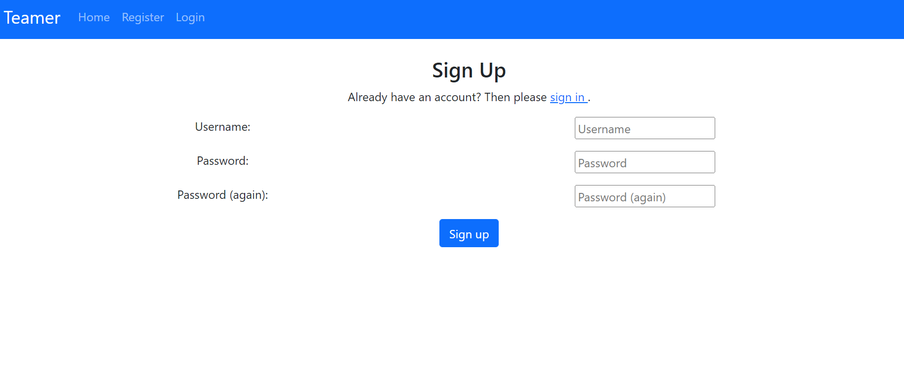
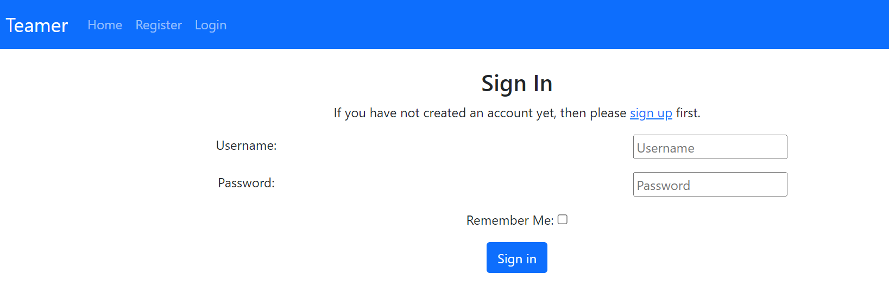
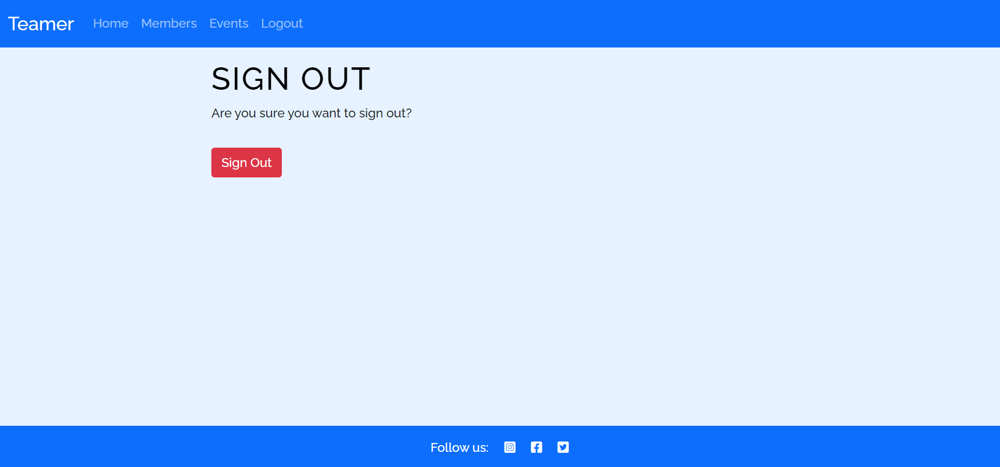

# Teamer

Teamer is a football group designed in a way that users can manage and organise the members and events. This site allows users to create event, add members to the group, add members to the event and delete event.

A live website can be found [here](https://teamer-app.herokuapp.com/).

<!-- TOC -->
## Table of Contents
<!-- TOC start -->
- [Teamer](#Teamer)
  * [Table of Contents](#table-of-contents)
    + [Project Design](#project-design)
    + [User Experience](#user-experience)
    + [Project Goals](#project-goals)
    + [User Stories](#user-stories)
    + [Wireframe](#wireframe-1)
    + [Features](#features)
    + [Languages Used](#languages-used)
    + [Technology Used](#technology-used)
    + [Testing](#testing)
      - [Validation Testing:](#validation-testing)
    + [Bugs:](#bugs)
      - [Fixed Bugs:](#fixed-bugs)
      - [Unfixed Bug:](#unfixed-bug)
    + [Deployment:](#deployment)
    + [References:](#references)
    + [Acknowledgements](#acknowledgements)
<!-- TOC end -->
 

# User Experience

### Project Goals
The goal of the project is to create a football group where players can add themselves by signing up where they can create an event and delete an event.

The personal goals for this website are:     
- The site is easy to navigate and user friendly.
- The purpose of the site is evident and inviting to users.
- That users want to signup and engage with its content. 
 

### User Stories
As a first time I want to:

- Easily understand the main purpose of the site, so that I can easily use the site.
- Easily navigate through the site, so that I can easily find content and clearly see where I am on the site.
- Signup to the website, independently register and gain access to the website.
- Login into the website which allows a user to gain access to an application by entering their username and password.
- Be able to create an event and delete event.
- Social media links make it easier for users to find your business and connect with your customers.

As a returning visitor I want to:

- Easily able to create event.
- Easily add members to the event.
- Easily able to delete event and member from the group.

# Wireframe
- [Balsamiq](https://balsamiq.com/) was used to create wireframes for the website.For this project, I created three different wireframes for three different devices. Balsamiq wireframe is used to create outline of the website.  

    | Page | Wireframe |
    | --- | --- |
    | Home Page |  | 
    | Members Page |   | 
    | Events Page |  | 
    | Log In Page |  | 
    | Mobile |   | 
    | Tablet |   | 
 
 

### Entity Relationship Diagram

# Features

### All pages
- The navigation bar is placed at the top of all pages. The navigation bar is dynamic in that meaning depending on if the user is logged in or not the options will change.
- If the user is logged in the navigation bar will look like this:

- If the user is not logged in the navigation bar will look like this:

### Register Page
- A signup form which requires the member to enter username and a password. The pasword must be entered again for confirmation.
- Once the user has successfully signed up, this will automatically log in and direct the user to the create profile page.

### Login Page
- A login form that requires the user to enter their username and password that they used when signing up to the site.

### Logout Page
- When clicking logout from the navigation bar, the member will be redirected to the signout page.

### Landing Page
- Landing page with the image of players from different teams.
- An introduction about the football group.

### Create Profile Page
- Once the member has registered they will be redirected to the create profile page. The page displays a form for the member to enter their first name, last name, e-mail address and telephone number.

### Create new event Page
- Create new event Page allows members to create new event with form that consists of name, place, date and time.

### Event details page
- Event details page consists of event name, organizer, place, date/time and who's playing.
- It also have add me to this game and delete this game button.

### Members page
- 

# Technologies Used

[Go to the top](#table-of-contents)

-   [HTML5](https://en.wikipedia.org/wiki/HTML)
    -   The project uses HyperText Markup Language.
-   [CSS3](https://en.wikipedia.org/wiki/CSS)
    -   The project uses Cascading Style Sheets.
-   [JavaScript](https://en.wikipedia.org/wiki/JavaScript)
    -   The project uses JavaScript.
-   [Python](https://en.wikipedia.org/wiki/Python_(programming_language))
    -   The project uses Python.
-   [Boostrap 5](https://getbootstrap.com/docs/5.0/getting-started/introduction/)
    -   The project uses Bootstrap 5.
-   [PostgreSQL](https://www.postgresql.org/)
    -   The project uses PostgreSQL as a database.
-   [Gitpod](https://www.gitpod.io/)
    -   The project uses Gitpod.
-   [Chrome](https://www.google.com/intl/en_uk/chrome/)
    -   The project uses Chrome to debug and test the source code using HTML5.
-   [Balsamiq](https://balsamiq.com/)
    -   Balsamiq was used to create the wireframes during the design process.
-   [Google Fonts](https://fonts.google.com/)
    -   Google fonts were used to import the "Be Vietnam Pro" font into the style.css file which is used on all pages throughout the project.
-   [GitHub](https://github.com/)
    -   GitHub was used to store the project's code after being pushed from Git.

# Testing

### Navigation bar

TEST            | OUTCOME                          | PASS / FAIL  
--------------- | -------------------------------- | ---------------
Home page | When clicking the home button in the navigation bar, the browser redirects me to the home page.  | PASS
Members page | When clicking the members button in the navigation bar, the browser redirects me to the members page. | PASS
Events page | When clicking the events button in the navigation bar, the browser redirects me to the events page.  | PASS
Register page | When clicking the register button in the navigation bar, the browser redirects me to the register page. The user will know they are on this page by the heading. | PASS
Login / Logout page | When clicking the login or logout button in the navigation bar, the browser redirects me to the login or logout page. The user will know they are on this page by the heading. | PASS
Text | Checked that all fonts and colours used are consistent. | PASS

### Footer
TEST            | OUTCOME                          | PASS / FAIL  
--------------- | -------------------------------- | ---------------
Facebook | When clicking the Facebook icon, a new tab opens and redirects to the Facebook website. | PASS
Twitter | When clicking the Twitter icon, a new tab opens and redirects to the Twitter website. | PASS
Instagram | When clicking the Instagram icon, a new tab opens and redirects to the Instagram website. | PASS

### Home page
TEST            | OUTCOME                          | PASS / FAIL  
--------------- | -------------------------------- | ---------------
Media | All media assets are displayed properly, have no pixelation or stretched images and is responsive on all devices. | PASS
Responsiveness | Check every element on the page for consistent scalability in mobile, tablet and desktop view.| PASS
Accessibility | Checked the accessibility of the page using lighthouse| PASS

### Members page
TEST            | OUTCOME                          | PASS / FAIL  
--------------- | -------------------------------- | ---------------
Media | All media assets are displayed properly, have no pixelation or stretched images and is responsive on all devices. | PASS
Responsiveness | Check every element on the page for consistent scalability in mobile, tablet and desktop view.| PASS
Accessibility | Checked the accessibility of the page using lighthouse| PASS

### Events page
TEST            | OUTCOME                          | PASS / FAIL  
--------------- | -------------------------------- | ---------------
Media | All media assets are displayed properly, have no pixelation or stretched images and is responsive on all devices. | PASS
Responsiveness | Check every element on the page for consistent scalability in mobile, tablet and desktop view.| PASS
Accessibility | Checked the accessibility of the page using lighthouse| PASS

### Register page
TEST            | OUTCOME                          | PASS / FAIL  
--------------- | -------------------------------- | ---------------
Media | All media assets are displayed properly, have no pixelation or stretched images and is responsive on all devices. | PASS
Responsiveness | Check every element on the page for consistent scalability in mobile, tablet and desktop view.| PASS
Accessibility | Checked the accessibility of the page using lighthouse| PASS

### Event details page
TEST            | OUTCOME                          | PASS / FAIL  
--------------- | -------------------------------- | ---------------
Media | All media assets are displayed properly, have no pixelation or stretched images and is responsive on all devices. | PASS
Responsiveness | Check every element on the page for consistent scalability in mobile, tablet and desktop view.| PASS
Accessibility | Checked the accessibility of the page using lighthouse| PASS

### Create event page
TEST            | OUTCOME                          | PASS / FAIL  
--------------- | -------------------------------- | ---------------
Media | All media assets are displayed properly, have no pixelation or stretched images and is responsive on all devices. | PASS
Responsiveness | Check every element on the page for consistent scalability in mobile, tablet and desktop view.| PASS
Accessibility | Checked the accessibility of the page using lighthouse| PASS

### Create Profile page
TEST            | OUTCOME                          | PASS / FAIL  
--------------- | -------------------------------- | ---------------
Media | All media assets are displayed properly, have no pixelation or stretched images and is responsive on all devices. | PASS
Responsiveness | Check every element on the page for consistent scalability in mobile, tablet and desktop view.| PASS
Accessibility | Checked the accessibility of the page using lighthouse| PASS

### SignIn page
TEST            | OUTCOME                          | PASS / FAIL  
--------------- | -------------------------------- | ---------------
Media | All media assets are displayed properly, have no pixelation or stretched images and is responsive on all devices. | PASS
Responsiveness | Check every element on the page for consistent scalability in mobile, tablet and desktop view.| PASS
Accessibility | Checked the accessibility of the page using lighthouse| PASS

### Signout page
TEST            | OUTCOME                          | PASS / FAIL  
--------------- | -------------------------------- | ---------------
Media | All media assets are displayed properly, have no pixelation or stretched images and is responsive on all devices. | PASS
Responsiveness | Check every element on the page for consistent scalability in mobile, tablet and desktop view.| PASS
Accessibility | Checked the accessibility of the page using lighthouse| PASS

- [Validation Testing:](#validation-testing)

### Html Validation
I used [W3C Markup](https://validator.w3.org/#validate_by_input+with_options) to check for any errors within the HTML pages.

### Deployment

[Go to the top](#table-of-contents)

I used the terminal to deploy my project locally. To do this I had to:
1. Create a repository on GitHub.
2. Clone the repository on your chosen source code editor (GitPod in my case) using the clone link.
3. Open the terminal within GitPod
4. Enter "python3 manage.py runserver into the terminal.
5. Go to local host address on my web browser.
6. All locally saved changes will show up here.

For the final deployment to Heroku, I had to:
1. Uncomment the PostgreSQL databse from my settings.py file.
2. Set debug = False in my settings.py file.
3. Commit and push all files to GitHub
3. In Heroku, remove the DISABLE_COLLECTSTATIC config var.
4. In the deploy tab, go to the manual deploy sections and click deploy branch.

