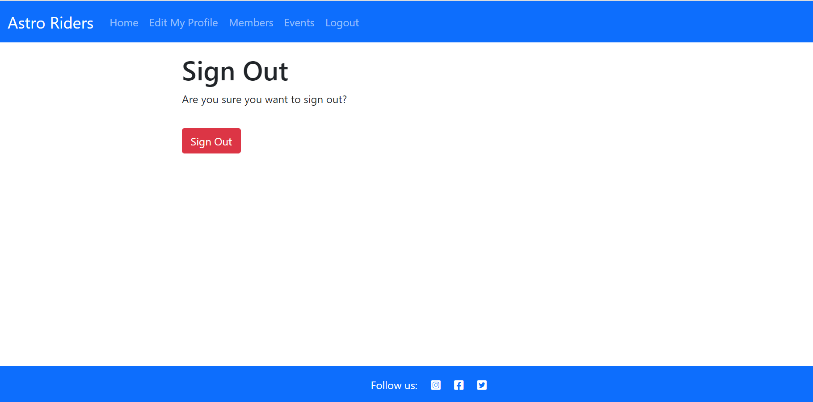
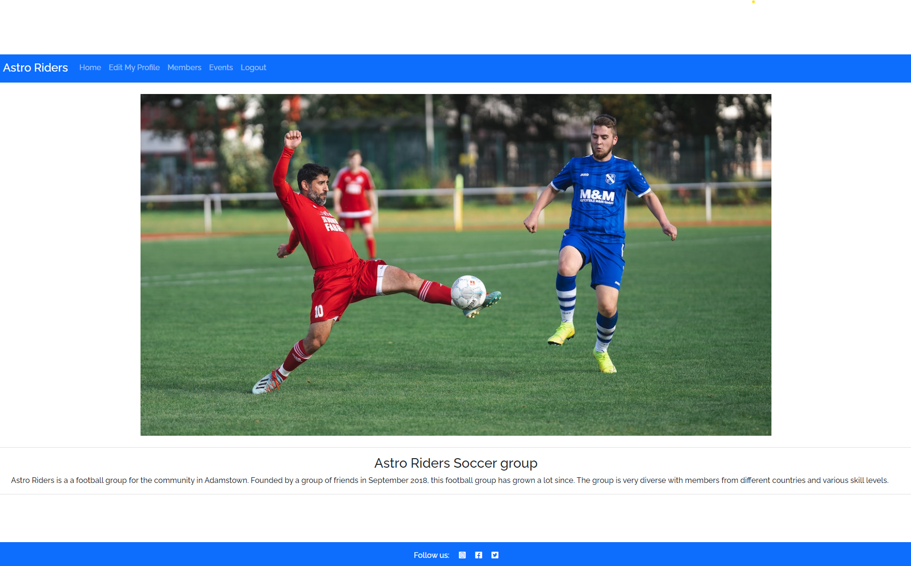
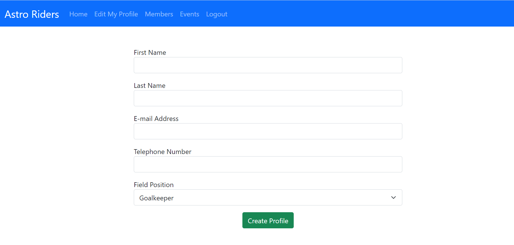
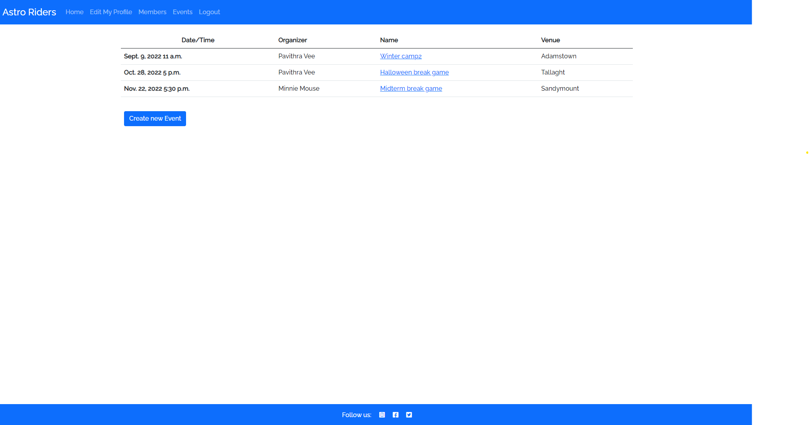
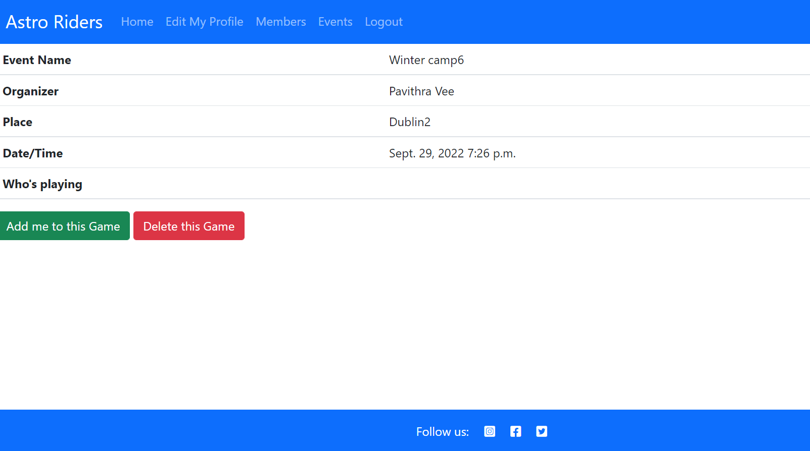
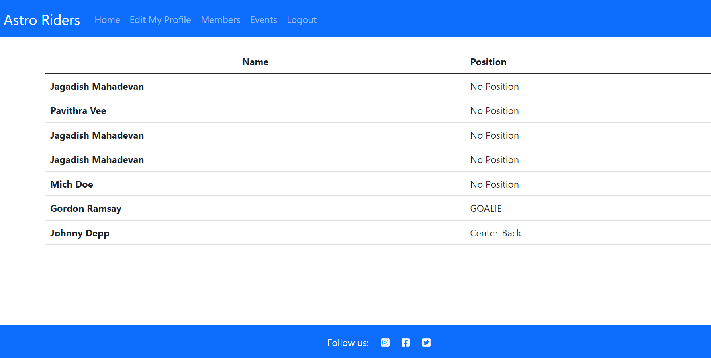
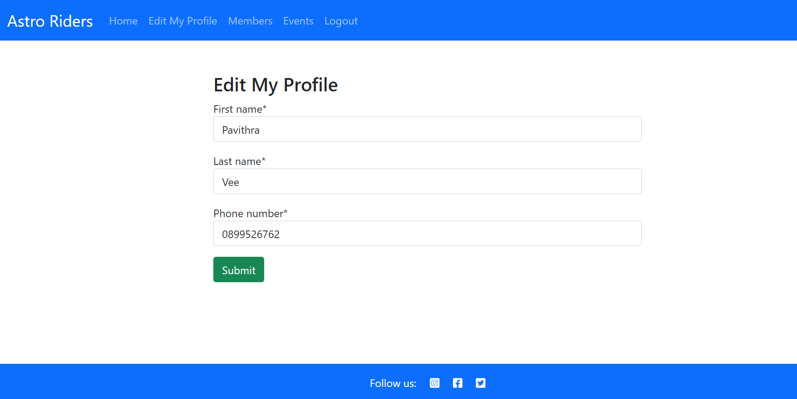

# Teamer

Teamer is a football group designed in a way that users can manage and organise the members and events. This site allows users to create event, add members to the group, add members to the event and delete event.

A live website can be found [here](https://teamer-app.herokuapp.com/).


<!-- TOC --><a name="table-of-contents"></a>
## Table of Contents
<!-- TOC start -->
- [Teamer](#Teamer)
  * [Table of Contents](#table-of-contents)
    + [User Experience](#user-experience)
    + [Project Goals](#project-goals)
    + [Scope](#scope)
      - [User Stories](#user-stories)
    + [Project Management](#project-management)
    + [Wireframe](#wireframe-1)
    + [Features](#features)
    + [Languages Used](#languages-used)
    + [Technology Used](#technology-used)
    + [Testing](#testing)
      - [Validation Testing:](#validation-testing)
    + [Bugs:](#bugs)
      - [Fixed Bugs:](#fixed-bugs)
      - [Unfixed Bug:](#unfixed-bug)
    + [Deployment:](#deployment)
    + [Credits:](#credits)
    + [Acknowledgements](#acknowledgements)
<!-- TOC end -->
<br/>

# User Experience

### Project Goals
The goal of the project is to create a football group where players can add themselves by signing up where they can create an event and delete an event.

The personal goals for this website are:     
- The site is easy to navigate and user friendly.
- The purpose of the site is evident and inviting to users.
- That users want to signup and engage with its content. 
<br/>

### User Stories
As a first time I want to:

- Easily understand the main purpose of the site, so that I can easily use the site.
- Easily navigate through the site, so that I can easily find content and clearly see where I am on the site.
- Signup to the website, independently register and gain access to the website.
- Login into the website which allows a user to gain access to an application by entering their username and password.
- Be able to create an event and delete event.
- Social media links make it easier for users to find your business and connect with your customers.

As a returning visitor:

- As a returning visitor, I want to create event.
- As a returning visitor, I want to add myself to the event.
- As a returning visitor, I want to delete the game and myself from the game.

# Project Management

GitHub projects was used as aproject management tool. Kanban board was used to add user stories and follow the project progress.

**Week 1**


**Week 2**


**Week 3**


**week 4**


**Week 5**


**Week 6**


**Week 7**


# Wireframe
- [Balsamiq](https://balsamiq.com/) was used to create wireframes for the website.For this project, I created three different wireframes for three different devices. Balsamiq wireframe is used to create outline of the website.  

    | Page | Wireframe |
    | --- | --- |
    | Home Page |  | 
    | Members Page |   | 
    | Events Page |  | 
    | Log In Page |  | 
    | Mobile |   | 
    | Tablet |   | 
 
 <hr>

 ### Typography

 The main font used in the site is raleway. With sanserif as fall back font incase raleway is not imported properly. 

### Entity Relationship Diagram


# Features

### All pages
- The navigation bar is placed at the top of all pages. The navigation bar is dynamic in that meaning depending on if the user is logged in or not the options will change.
- If the user is logged in the navigation bar will look like this:

- If the user is not logged in the navigation bar will look like this:


### Register Page
- A signup form which requires the member to enter username and a password. The pasword must be entered again for confirmation.
- Once the user has successfully signed up, this will automatically log in and direct the user to the create profile page.


### Login Page
- A login form that requires the user to enter their username and password that they used when signing up to the site.


### Logout Page
- When clicking logout from the navigation bar, the member will be redirected to the signout page.


### Home Page
- Landing page with the image of players from different teams.
- An introduction about the football group.


### Create Profile Page
- Once the member has registered they will be redirected to the create profile page. The page displays a form for the member to enter their first name, last name, e-mail address, telephone number and field position.


### Create new event Page
- Create new event Page allows members to create new event with form that consists of name, place, date and time.


### Event details page
- Event details page consists of event name, organizer, place, date/time and who's playing.
- It also have add me to this game and delete this game button.


### Members page
- Members page is launched when the user signup and create profile form.
- It consists of name and preferred position of the member.


### Edit my profile
- Edit profile page allows members to edit their profile which was created in the create profile.
- It consists of first name, lastname and telephone number.


# Technologies Used

[Go to the top](#table-of-contents)

-   [HTML5](https://en.wikipedia.org/wiki/HTML)
    -   The project uses HyperText Markup Language.
-   [CSS3](https://en.wikipedia.org/wiki/CSS)
    -   The project uses Cascading Style Sheets.
-   [JavaScript](https://en.wikipedia.org/wiki/JavaScript)
    -   The project uses JavaScript.
-   [Python](https://en.wikipedia.org/wiki/Python_(programming_language))
    -   The project uses Python.
-   [Boostrap 5](https://getbootstrap.com/docs/5.0/getting-started/introduction/)
    -   The project uses Bootstrap 5.
-   [PostgreSQL](https://www.postgresql.org/)
    -   The project uses PostgreSQL as a database.
-   [Gitpod](https://www.gitpod.io/)
    -   The project uses Gitpod.
-   [Chrome](https://www.google.com/intl/en_uk/chrome/)
    -   The project uses Chrome to debug and test the source code using HTML5.
-   [Balsamiq](https://balsamiq.com/)
    -   Balsamiq was used to create the wireframes during the design process.
-   [Google Fonts](https://fonts.google.com/)
    -   Google fonts were used to import the "Be Vietnam Pro" font into the style.css file which is used on all pages throughout the project.
-   [GitHub](https://github.com/)
    -   GitHub was used to store the project's code after being pushed from Git.

# Testing

### Navigation bar

TEST            | OUTCOME                          | PASS / FAIL  
--------------- | -------------------------------- | ---------------
Home page | When clicking the home button in the navigation bar, the browser redirects me to the home page.  | PASS
Members page | When clicking the members button in the navigation bar, the browser redirects me to the members page. | PASS
Events page | When clicking the events button in the navigation bar, the browser redirects me to the events page.  | PASS
Register page | When clicking the register button in the navigation bar, the browser redirects me to the register page. The user will know they are on this page by the heading. | PASS
Login / Logout page | When clicking the login or logout button in the navigation bar, the browser redirects me to the login or logout page. The user will know they are on this page by the heading. | PASS
Text | Checked that all fonts and colours used are consistent. | PASS

### Footer
TEST            | OUTCOME                          | PASS / FAIL  
--------------- | -------------------------------- | ---------------
Facebook | When clicking the Facebook icon, a new tab opens and redirects to the Facebook website. | PASS
Twitter | When clicking the Twitter icon, a new tab opens and redirects to the Twitter website. | PASS
Instagram | When clicking the Instagram icon, a new tab opens and redirects to the Instagram website. | PASS

### Home page
TEST            | OUTCOME                          | PASS / FAIL  
--------------- | -------------------------------- | ---------------
Media | All media assets are displayed properly, have no pixelation or stretched images and is responsive on all devices. | PASS
Responsiveness | Check every element on the page for consistent scalability in mobile, tablet and desktop view.| PASS
Accessibility | Checked the accessibility of the page using lighthouse| PASS

### Members page
TEST            | OUTCOME                          | PASS / FAIL  
--------------- | -------------------------------- | ---------------
Media | All media assets are displayed properly, have no pixelation or stretched images and is responsive on all devices. | PASS
Responsiveness | Check every element on the page for consistent scalability in mobile, tablet and desktop view.| PASS
Accessibility | Checked the accessibility of the page using lighthouse| PASS

### Events page
TEST            | OUTCOME                          | PASS / FAIL  
--------------- | -------------------------------- | ---------------
Media | All media assets are displayed properly, have no pixelation or stretched images and is responsive on all devices. | PASS
Responsiveness | Check every element on the page for consistent scalability in mobile, tablet and desktop view.| PASS
Accessibility | Checked the accessibility of the page using lighthouse| PASS

### Register page
TEST            | OUTCOME                          | PASS / FAIL  
--------------- | -------------------------------- | ---------------
Media | All media assets are displayed properly, have no pixelation or stretched images and is responsive on all devices. | PASS
Responsiveness | Check every element on the page for consistent scalability in mobile, tablet and desktop view.| PASS
Accessibility | Checked the accessibility of the page using lighthouse| PASS

### Event details page
TEST            | OUTCOME                          | PASS / FAIL  
--------------- | -------------------------------- | ---------------
Media | All media assets are displayed properly, have no pixelation or stretched images and is responsive on all devices. | PASS
Responsiveness | Check every element on the page for consistent scalability in mobile, tablet and desktop view.| PASS
Accessibility | Checked the accessibility of the page using lighthouse| PASS

### Create event page
TEST            | OUTCOME                          | PASS / FAIL  
--------------- | -------------------------------- | ---------------
Media | All media assets are displayed properly, have no pixelation or stretched images and is responsive on all devices. | PASS
Responsiveness | Check every element on the page for consistent scalability in mobile, tablet and desktop view.| PASS
Accessibility | Checked the accessibility of the page using lighthouse| PASS

### Create Profile page
TEST            | OUTCOME                          | PASS / FAIL  
--------------- | -------------------------------- | ---------------
Media | All media assets are displayed properly, have no pixelation or stretched images and is responsive on all devices. | PASS
Responsiveness | Check every element on the page for consistent scalability in mobile, tablet and desktop view.| PASS
Accessibility | Checked the accessibility of the page using lighthouse| PASS

### SignIn page
TEST            | OUTCOME                          | PASS / FAIL  
--------------- | -------------------------------- | ---------------
Media | All media assets are displayed properly, have no pixelation or stretched images and is responsive on all devices. | PASS
Responsiveness | Check every element on the page for consistent scalability in mobile, tablet and desktop view.| PASS
Accessibility | Checked the accessibility of the page using lighthouse| PASS

### Signout page
TEST            | OUTCOME                          | PASS / FAIL  
--------------- | -------------------------------- | ---------------
Media | All media assets are displayed properly, have no pixelation or stretched images and is responsive on all devices. | PASS
Responsiveness | Check every element on the page for consistent scalability in mobile, tablet and desktop view.| PASS
Accessibility | Checked the accessibility of the page using lighthouse| PASS

- [Validation Testing:](#validation-testing)

### Responsive Tools
[Am I Responsive](https://ui.dev/amiresponsive) was used to check if all screens are responsive to all devices.

### Html Validation
I used [W3C Markup](https://validator.w3.org/#validate_by_input+with_options) to check for any errors within the HTML pages.

#### CSS:
[W3C CSS Validation](https://jigsaw.w3.org/css-validator/) to check for any errors within my CSS stylesheet.
[css_validation](static/wireframes/css-validator-screenshot.png)

### Python
[PeP 8](http://pep8online.com/) to check for any errors in python code.

models.py


urls.py


views.py


### Bugs


### Deployment

[Go to the top](#table-of-contents)

To deploy this page to Heroku from its GitHub repository, the following steps were taken:

1. Create the Heroku App:
    - Select "Create new app" in Heroku.
    - Choose a name for your app and select the location.

2. Attach the Postgres database:
    - In the Resources tab, under add-ons, type in Postgres and select the Heroku Postgres option.

3. Prepare the environment and settings.py file:
    * In the Settings tab, click on Reveal Config Vars and copy the url next to DATABASE_URL.
    * In your GitPod workspace, create an env.py file in the main directory. 
    * Add the DATABASE_URL value and your chosen SECRET_KEY value to the env.py file.
    * Add the SECRET_KEY value to the Config Vars in Heroku.
    * Update the settings.py file to import the env file and add the SECRETKEY and DATABASE_URL file paths.
    * Update the Config Vars with the Cloudinary url, adding into the settings.py file also.
    * In settings.py add the following sections:
        * Cloudinary to the INSTALLED_APPS list
        * STATICFILE_STORAGE
        * STATICFILES_DIRS
        * STATIC_ROOT
        * MEDIA_URL
        * DEFAULT_FILE_STORAGE
        * TEMPLATES_DIR
        * Update DIRS in TEMPLATES with TEMPLATES_DIR
        * Update ALLOWED_HOSTS with ['app_name.heroku.com', 'localhost']

4. Store Static and Media files in Cloudinary and Deploy to Heroku:
    - Create three directories in the main directory; media, storage and templates.
    - Create a file named "Procfile" in the main directory and add the following:
        - web: gunicorn project-name.wsgi
    - Go to Deploy tab on Heroku and connect to the GitHub, then to the required recpository.
    Click on Delpoy Branch and wait for the build to load. When the build is complete, the app can be opened through Heroku.

### Forking the Repository
By forking the GitHub Repository we make a copy of the original repository on our GitHub account to view and/or make changes without affecting the original repository by using the following steps...

1. Log into [GitHub](https://github.com/login) or [create an account](https://github.com/join).
2. Locate the [GitHub Repository](https://github.com/Pavithra-Veeramani/teamer).
3. At the top of the repository, on the right side of the page, select "Fork"
4. You should now have a copy of the original repository in your GitHub account.

### Creating a Clone
How to run this project locally:
1. Install the [GitPod Browser](https://www.gitpod.io/docs/browser-extension/ "Link to Gitpod Browser extension download") Extension for Chrome.
2. After installation, restart the browser.
3. Log into [GitHub](https://github.com/login "Link to GitHub login page") or [create an account](https://github.com/join "Link to GitHub create account page").
2. Locate the [GitHub Repository](https://github.com/Pavithra-Veeramani/teamer).
5. Click the green "GitPod" button in the top right corner of the repository.
This will trigger a new gitPod workspace to be created from the code in github where you can work locally.

How to run this project within a local IDE, such as VSCode:

1. Log into [GitHub](https://github.com/login) or [create an account](https://github.com/join).
2. Locate the [GitHub Repository](https://github.com/Pavithra-Veeramani/teamer).
3. Under the repository name, click "Clone or download".
4. In the Clone with HTTPs section, copy the clone URL for the repository.
5. In your local IDE open the terminal.
6. Change the current working directory to the location where you want the cloned directory to be made.
7. Type 'git clone', and then paste the URL you copied in Step 3.
```
git clone https://github.com/Pavithra-Veeramani/teamer
```
8. Press Enter. Your local clone will be created.

Further reading and troubleshooting on cloning a repository from GitHub [here](https://docs.github.com/en/free-pro-team@latest/github/creating-cloning-and-archiving-repositories/cloning-a-repository)


<a name="end-product"></a>

# Credits

### Media

[Pexels](https://www.pexels.com/) 
- Home Page image taken by [Omar Ramadan](https://www.pexels.com/@omar-ramadan-1739260/)

### Code
[Stack Overflow](https://stackoverflow.com/) were referenced to get better ideas in order to understand and implement the code.
[Bootstrap](https://getbootstrap.com/) were referenced for the bootstrap ideas. 


### Acknowledgements

- Thanks to my mentor Marcel Mulders for his support and feedback.

- Thanks to the tutor support in code institute for their support.


